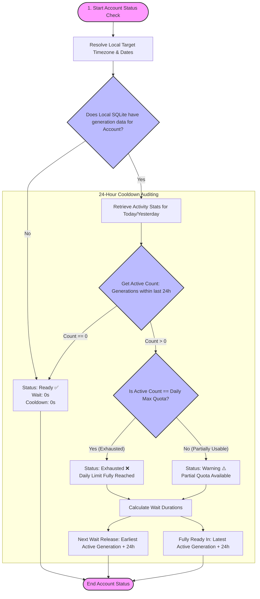

# Technical Requirements Document (TRD): ChatGPT to Notion Sync Tool

## 1. Introduction & Architectural Overview
This document translates the product goals defined in [docs/requirement.md](requirement.md) into concrete architectural blocks, execution paradigms, and state transitions.

The **ChatGPT to Notion Image Archiver & Sync Tool** is a local-first, rate-limit resilient, and highly scriptable Command Line Interface (CLI) utility. It is designed to act as a secure intermediary between generative histories (ChatGPT) and long-term search registries (Notion).

### Core Architecture Goals:
- **Local Sovereignty**: All credentials, configuration options, downloaded assets, and execution states reside solely on the user's host machine. No intermediary cloud service or third-party server is used.
- **Strict CLI Design**: Zero visual interface overhead. It must remain lightweight, scriptable, and capable of execution via terminal commands or background tasks (e.g., cron jobs).
- **Transactional Integrity**: Every state transition (crawling $\rightarrow$ downloading $\rightarrow$ metadata-tagging $\rightarrow$ uploading $\rightarrow$ conversation-deletion) must be fully tracked to prevent duplicate uploads, resource leaks, or premature thread cleanup.

---

## 2. Technology Stack & Key Libraries

To enforce high performance, fast startup speeds, and system reliability, the utility leverages a lightweight, asynchronous pythonic runtime stack:

```text
┌────────────────────────────────────────────────────────┐
│                   CLI Runtime Stack                    │
├───────────────────┬───────────────────┬────────────────┤
│       Core        │    Networking     │  Persistence   │
├───────────────────┼───────────────────┼────────────────┤
│    Python 3.13    │  aiohttp (Async)  │ SQLite (Local) │
│ Pydantic Schemas  │ Tenacity Retries  │  Vanilla SQL   │
└───────────────────┴───────────────────┴────────────────┘
```

1. **Language & Environment**: Python 3.13, structured under flat functional modules without heavy nested frameworks.
2. **Input & CLI Processing**: A robust terminal argument parser supporting configurable switches (`--check-notion-api`, `--account`, `--limit`).
3. **Concurrency & HTTP Networking**: Non-blocking asynchronous network requests powered by an async HTTP library (`aiohttp`). Rate-limiting and transit fluctuations are handled elegantly using exponential backoff retry cycles (`tenacity`).
4. **Data Modeling & Validation**: Strict type guarantees and schema enforcement for API payloads using parsing schemas (`Pydantic v2`).
5. **Asset Processing**: Pixel metadata operations (reading and writing embedded prompt headers in binary files) handled via specialized local image modules.
6. **Local Index Storage**: SQLite database wrapping standard relational transactions with zero external server dependencies.

---

## 3. Local Datastore & State Machine

To enforce absolute idempotency and resiliency, the local datastore tracks every individual asset generation through its lifecycle.

### Image Generations Table Layout (`image_generations`)
This lightweight table records every asset's progress from discovery to post-sync cleanup:

| Column Name | Data Type | Key Type | Description / State Role |
| :--- | :--- | :--- | :--- |
| `id` | TEXT | Primary Key | Unique image identifier (derived from ChatGPT generation metadata). |
| `conversation_id` | TEXT | - | ChatGPT historical thread identifier. |
| `message_id` | TEXT | - | Generative node ID where the image was returned. |
| `url` | TEXT | - | Remote transient CDN URL of the source image. |
| `prompt` | TEXT | - | Original prompt wording text injected into the image. |
| `uploaded_at` | TEXT | - | ISO-8601 Timestamp when native upload to Notion was fully committed. |

> **NOTE**:
> The database schema and table layout detailed above serves as an architectural baseline rather than a strict requirement. Fields and types should be adapted, expanded, or refined dynamically to match the actual JSON response payloads returned by the live ChatGPT API during discovery operations.

---

## 4. Agnostic Feature Flows

### 4.1 Image Sync Pipeline (upload-to-notion)
The pipeline executes as a sequential chain of stages designed to guarantee reliability, idempotency, and fail-safe side effects. The execution logic is entirely technology-agnostic and could be ported to any runtime language:

#### 4.1.1 Step-by-Step Flow Description
1. **Discovery Stage**: Crawl the generative service API histories for the specified account profile. Retrieve metadata list of recent visual generation nodes.
2. **Local Sync Audit (Deduplication)**: For each discovered generation, check the physical image download folder directly:
   - **Download Check**: Query the destination folder to see if the corresponding image file already exists on disk.
   - **If File is Missing**: Initiate a new HTTP request to download the high-resolution asset from the source URL.
   - **If File Exists**: Skip the download stage entirely to avoid redundant network consumption.
   - **SQLite Registry**: Ensure the generation is properly indexed in the local SQLite database.
3. **Context Enrichment (Metadata Injection)**: Read the local binary file.
   - Audit its internal metadata chunks (e.g., standard PNG tEXt/iTXt headers).
   - If prompt text is missing: Inject the original prompt wording directly into the file header and write back to disk.
   - If prompt exists: Skip disk writing to prevent redundant physical media wear.
4. **Notion Registry Pipeline**:
   - Check if `uploaded_at` is flagged in SQLite.
   - If not flagged, query the Notion Database API directly to verify if the unique image ID exists (handling scenarios where local state was lost but Notion contains the page).
   - If not found on Notion: Initiate a native multi-part file stream. Create a new page, set the title, host the file permanently, and format the prompt cleanly as a Markdown block inside the page's body.
   - Once successfully published: Record `uploaded_at` timestamp inside SQLite.
5. **Fail-Safe Post-Sync Cleanup**:
   - If post-sync thread cleanup is requested, the system performs a multi-layered verification to guarantee the asset is securely hosted in Notion before triggering deletion.
   - **Ordered Verification Layers**:
     1. **Remote Check (Preferred)**: Query the Notion API directly using the unique image ID to verify the page exists in the remote workspace. This remote verification is driven by the `--check-notion-api` option, which is **enabled by default**.
     2. **Local Fallback**: If the remote Notion check is disabled or cannot be reached, verify if the `uploaded_at` timestamp is successfully marked in the local SQLite database.
   - **Safety Boundary**: If neither layer confirms a successful upload (i.e., remote Notion page is missing and local `uploaded_at` is empty), **strictly block deletion**. Output a warning log and abort the deletion request.
   - **Execution**: If verified as successfully synced, send the patch request to ChatGPT to hide/delete the conversation thread, and mark `is_deleted_from_chatgpt` to true in SQLite.

---

#### 4.1.2 System Flowchart (Mermaid)

```mermaid
flowchart TD
    Start([1. Start Sync Pipeline]) --> CheckConfig[Read Local Profile Configuration]
    CheckConfig --> FetchHistory[2. Crawl ChatGPT Generation History]
    
    subgraph Iteration["For each discovered Image Generation object"]
        FetchHistory --> CheckLocalDisk{Does file exist in download folder?}
        
        CheckLocalDisk -- No --> DownloadAsset[Download Raw Resolution Image]
        CheckLocalDisk -- Yes --> VerifyPrompt{Does file contain Prompt Metadata?}
        
        DownloadAsset --> InjectMetadata[3. Inject Prompt into PNG Metadata Headers]
        VerifyPrompt -- No --> InjectMetadata
        VerifyPrompt -- Yes --> SkipEnrichment[Skip Disk Write]
        
        InjectMetadata --> SyncNotion{Is Uploaded to Notion?}
        SkipEnrichment --> SyncNotion
        
        SyncNotion -- No --> CheckNotionRemote{Verify Notion Database via API}
        SyncNotion -- Yes --> CheckCleanup
        
        CheckNotionRemote -- Found (Duplicate) --> MarkUploaded[Mark 'uploaded_at' in SQLite]
        CheckNotionRemote -- Not Found --> PublishNotion[4. Native Multipart Image Upload & Page Creation]
        
        PublishNotion --> MarkUploaded
        MarkUploaded --> CheckCleanup{Is Post-Sync Cleanup Enabled?}
        
        CheckCleanup -- Yes --> VerifyRemote{Verify exists on Notion API?\n--check-notion-api}
        CheckCleanup -- No --> EndIteration([End Item])
        
        VerifyRemote -- Yes --> DeleteChatGPT[5. Hide/Delete Conversation from ChatGPT]
        VerifyRemote -- No (Or Offline) --> VerifyLocal{Confirm 'uploaded_at' in Local DB?}
        
        VerifyLocal -- Yes --> DeleteChatGPT
        VerifyLocal -- No --> LogWarning[Log Warning: Deletion Blocked]
        
        DeleteChatGPT --> EndIteration
        LogWarning --> EndIteration
    end
    
    EndIteration --> PipelineSummary[Log Sync Stats & Execution Summary]
    PipelineSummary --> End([6. Finish Sync Pipeline])
    
    classDef step fill:#f9f,stroke:#333,stroke-width:2px;
    classDef decision fill:#bbf,stroke:#333,stroke-width:2px;
    class Start,End step;
    class CheckLocalDisk,VerifyPrompt,SyncNotion,CheckNotionRemote,CheckCleanup,VerifyUploadedState decision;
```



#### 4.1.3 Execution Modes: Sequential vs. Concurrent (Batch)
Depending on network stability, bandwidth, and asset volume, the image synchronization pipeline can be run in two distinct execution modes:

1. **Sequential Sync Mode (Highly Resilient)**:
   - **Mechanism**: Processes every discovered asset completely sequentially. The pipeline crawls, downloads, prompt-tags, and uploads item `N` before commencing any operations on item `N+1`.
   - **Use Case**: Best for automated daily cron jobs, slow or erratic connections, and minimal API traffic footprints.
   - **Advantages**: Easy to trace, extremely lightweight, and naturally transaction-safe (instant resumption exactly at the failed item).

2. **Concurrent Sync Mode (High-Speed Batching)**:
   - **Mechanism**: Spawns multiple concurrent worker routines to process assets in parallel. After crawling, downloads and native multi-part page uploads are dispatched to independent concurrent routines running in parallel.
   - **Use Case**: Best for first-time profile setups, massive backlogs, or fast connections.
   - **Advantages**: Peak throughput (reduces sync durations by up to 80%), leveraging full network capability.
   - **Design Boundary**: Requires structured exception handling inside the concurrent loop to guarantee that a failure in one asset's worker routine does not crash or interrupt the execution of other parallel workers.

---

### 4.2 Account Status Checker (accounts)
To efficiently pool generative capacity across multiple ChatGPT accounts, the CLI utility includes a technology-agnostic status checker. This auditor calculates the real-time availability of each account's image generation quota based on historical activity timestamps stored in the local datastore.

#### 4.2.1 Cooldown & Status Logic
1. **Empty Quota Audit**: Check if the local SQLite database contains any image generations for the account. If no generations are logged, the account is immediately considered **Ready** (`✅`).
2. **24-Hour Cooldown Auditing**:
   - Establish a 24-hour sliding cooldown threshold: `cooldown_threshold = now - 24 hours`.
   - Retrieve all image generations created by the account during the target date range (Today or Yesterday).
   - Filter and count the **Active Generations** — those generated *after* the `cooldown_threshold`.
3. **Availability State Determination**:
   - **Fully Ready** (`✅`): If `Active Generations == 0`, the daily quota is 100% free and ready to generate.
   - **Exhausted** (`❌`): If the count of active generations is equal to the account's maximum allowed daily quota limit, the quota is fully exhausted and must be locked.
   - **Warning / Partially Usable** (`⚠️`): If some active generations exist but the daily max limit is not yet reached, the account is under partial cooldown.
4. **Release & Cooldown Durations**:
   - **Next Wait / Release**: Set to `earliest_active_generation_timestamp + 24 hours`. This is the exact moment when the oldest generation slips outside the 24-hour sliding window, freeing up a quota slot.
   - **Fully Ready In**: Set to `latest_active_generation_timestamp + 24 hours`. This is the exact moment when all active generations clear the sliding window, fully restoring the quota capacity.

#### 4.2.2 Lifecycle Diagram (Mermaid)



---

## 5. Non-Functional Requirements & Design Patterns

To maintain a durable local-first pipeline, the program enforces the following operational design patterns:

### 5.1 Idempotency & Replay Support
- The index state (`SQLite`) act as the local source of truth. Any process interruption (crash, sudden sigterm, internet failure) will resume instantly from the exact point of failure on the next invocation.
- If live network crawling fails, the CLI supports an offline registry replay using local database indices to attempt republishing any failed uploads.

### 5.2 Network Rate-Limiting Resiliency
- Integration layers are governed by a retry loop.
- Standard transit errors (5xx server errors, connection resets) or standard API throttling (429 rate limit exceeded) are automatically delayed and retried using a progressive exponential backoff logic.

### 5.3 Memory and Disk Footprint Control
- When performing bulk multi-part uploads to Notion, streams are consumed incrementally rather than reading complete files into memory, keeping the footprint light and stable.
- Every disk operation on image files checks current headers first, minimizing SSD read/write degradation cycles.
